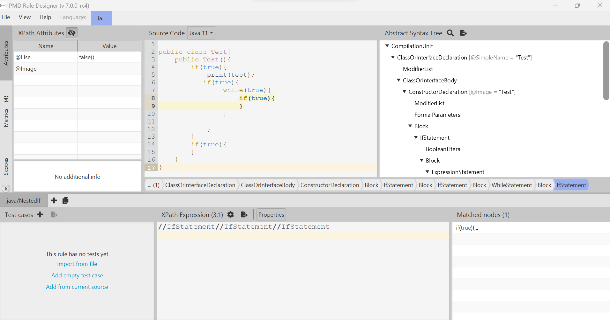

# Extending PMD

Use XPath to define a new rule for PMD to prevent complex code. The rule should detect the use of three or more nested `if` statements in Java programs so it can detect patterns like the following:

```Java
if (...) {
    ...
    if (...) {
        ...
        if (...) {
            ....
        }
    }

}
```
Notice that the nested `if`s may not be direct children of the outer `if`s. They may be written, for example, inside a `for` loop or any other statement.
Write below the XML definition of your rule.

You can find more information on extending PMD in the following link: https://pmd.github.io/latest/pmd_userdocs_extending_writing_rules_intro.html, as well as help for using `pmd-designer` [here](https://github.com/selabs-ur1/VV-ISTIC-TP2/blob/master/exercises/designer-help.md).

Use your rule with different projects and describe you findings below. See the [instructions](../sujet.md) for suggestions on the projects to use.

## Answer

To find the rules and testIt I have used the PMD designer. So I installed JavaFX and set my env variable.

Then I launched the PMD designer



With this designer, the custom rules became :

```xml

<?xml version="1.0" encoding="UTF-8"?>
<ruleset name="quickstart"
         xmlns="http://pmd.sourceforge.net/ruleset/2.0.0"
         xmlns:xsi="http://www.w3.org/2001/XMLSchema-instance"
         xsi:schemaLocation="http://pmd.sourceforge.net/ruleset/2.0.0 https://pmd.sourceforge.io/ruleset_2_0_0.xsd">
    <description>Quickstart configuration of PMD. Includes the rules that are most likely to apply everywhere.</description>

    <rule name="NestedIf"
      language="java"
      message="Too Many If"
      class="net.sourceforge.pmd.lang.rule.XPathRule">
   <description>
Cont the number of nested If
   </description>
   <priority>3</priority>
   <properties>
      <property name="version" value="3.1"/>
      <property name="xpath">
         <value>
            <![CDATA[
            //IfStatement//IfStatement//IfStatement
            
            ]]>
         </value>
      </property>
   </properties>
</rule>

</ruleset>


```


Finaly we found nested If with this rules in the common collection project.
For example in the file : 

```.\commons-collections\src\main\java\org\apache\commons\collections4\map\LRUMap.java:324:        NestedIf:       Too Many```

Here a sample of the concerned code : 

```java
protected void addMapping(final int hashIndex, final int hashCode, final K key, final V value) {
        if (isFull()) {
            LinkEntry<K, V> reuse = header.after;
            boolean removeLRUEntry = false;
            if (scanUntilRemovable) {
                while (reuse != header && reuse != null) {
                    if (removeLRU(reuse)) {
                        removeLRUEntry = true;
                        break;
                    }
                    reuse = reuse.after;
                }
```
